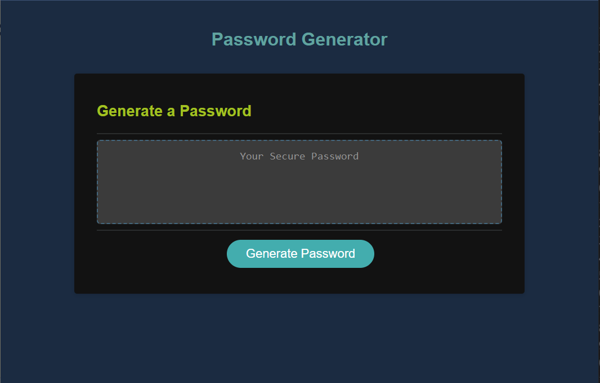

## Password-Generator

## Description

This is to assist users with creating a random and secure password easily and quickly. 

## Usage 

To acces the application functions you first click on "generate password" which will then prompt you for the specifications for the password. 
This is ranges from capital, lowercase, numbers, special characters, and length. 

## Created 

Chris Fraga

## License

[MIT License](https://www.mit.edu/~amini/LICENSE.md)

